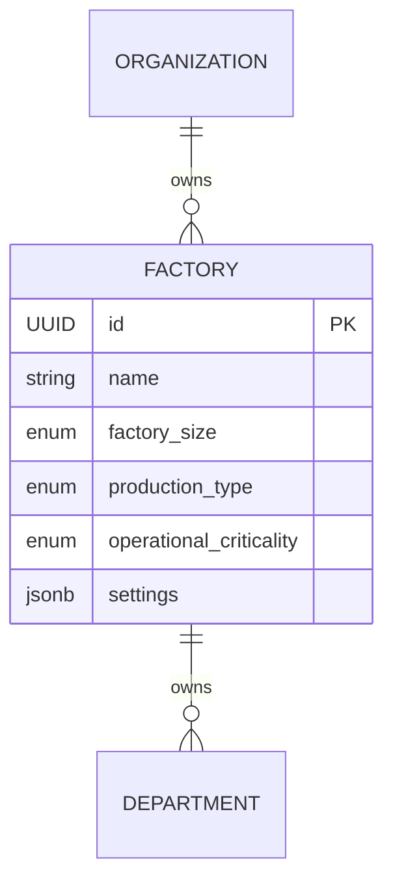

# Factory Module Documentation

## Overview
The Factory Module represents the physical industrial environment where operations occur. It serves as the foundational context engine for MechaMind OS AI agents, supplying them with industrial intelligence such as `ProductionType`, `OperationalCriticality`, and JSON-based AI settings.

## AI Context Configuration
The `Factory` model uses a flexible `settings: JSONB` column to store configurations without schema-locking the database.
```json
{
  "ai_settings": {
    "safety_enforcement": "STRICT",
    "agent_max_parallelism": 10
  }
}
```

## Architecture & Relationships


## API Overview
| Method | Endpoint | Description | Required Permission |
|--------|----------|-------------|---------------------|
| POST   | `/api/v1/factories` | Create a Factory | `factory.create` |
| GET    | `/api/v1/factories/{id}` | Get Factory Profile | `factory.read` (Scoped) |
| PUT    | `/api/v1/factories/{id}/settings` | Update Configs | `factory.update` (Scoped) |
