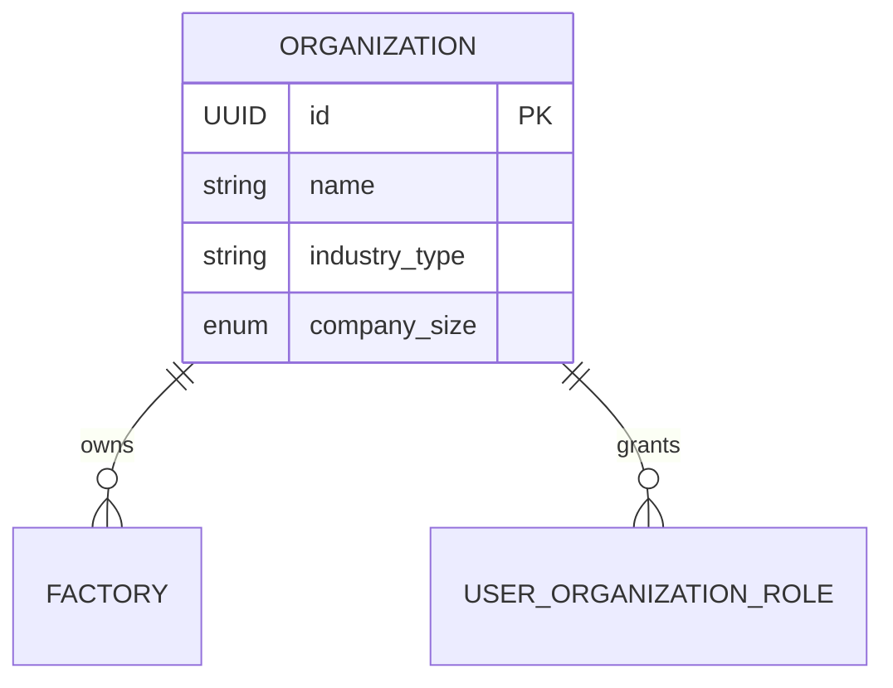

# Organization Module Documentation

## Overview
The Organization Module is the top-level entity in the MechaMind OS hierarchy. It represents an entire enterprise or company instance. In a multi-tenant deployment, the Organization acts as the strict isolation boundary.

## Architecture & Relationships

## API Overview
| Method | Endpoint | Description | Required Permission |
|--------|----------|-------------|---------------------|
| POST   | `/api/v1/organizations` | Create an Organization | `organization.create` |
| GET    | `/api/v1/organizations` | List Accessible Organizations | Auth Token |
| GET    | `/api/v1/organizations/{id}` | Get Org Details | `organization.read` |
| PUT    | `/api/v1/organizations/{id}` | Update Org Details | `organization.update` |
| DELETE | `/api/v1/organizations/{id}` | Soft Delete | `organization.delete` |

## Access Flow
By default, creating or managing Organizations requires Global Admin privileges (`ScopeType.GLOBAL`). Standard users can only read an organization if they hold a `UserOrganizationRole` granting them explicit read access, or if they hold roles at a lower level (Factory) within that organization.
