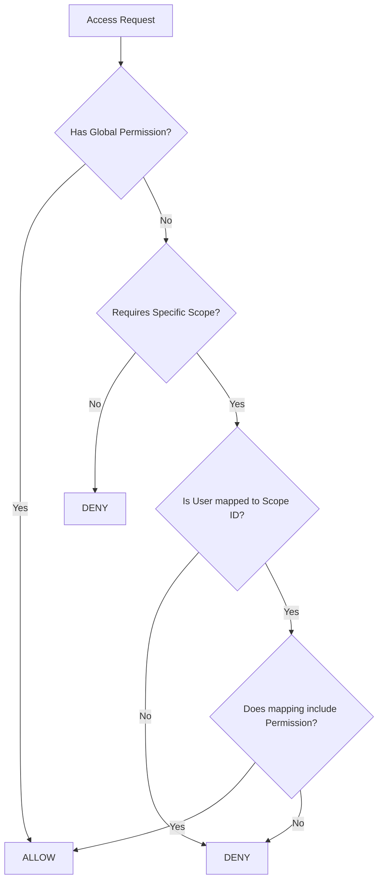

# Policy Engine Documentation

## Overview
The `PolicyEngine` (`app/core/policy.py`) is a highly-optimized logic matrix. It does not perform DB queries. Instead, it accepts pre-loaded maps of permissions and outputs absolute ALLOW/DENY decisions.

## Decision Matrix
1. **Default Deny:** If the user lacks the required permission -> DENY.
2. **SuperAdmin Override:** If the user has the permission at the `ScopeType.GLOBAL` level -> ALLOW.
3. **Exact Scope Match:** If the action targets `factory-uuid-1`, and the user's scope map contains `factory-uuid-1: {permissions}`, it checks for the required permission -> ALLOW.
4. **Scope Mismatch:** If the user has `maintenance.read` on `factory-uuid-1` but requests it on `factory-uuid-2` -> DENY.

## Mermaid Flow

