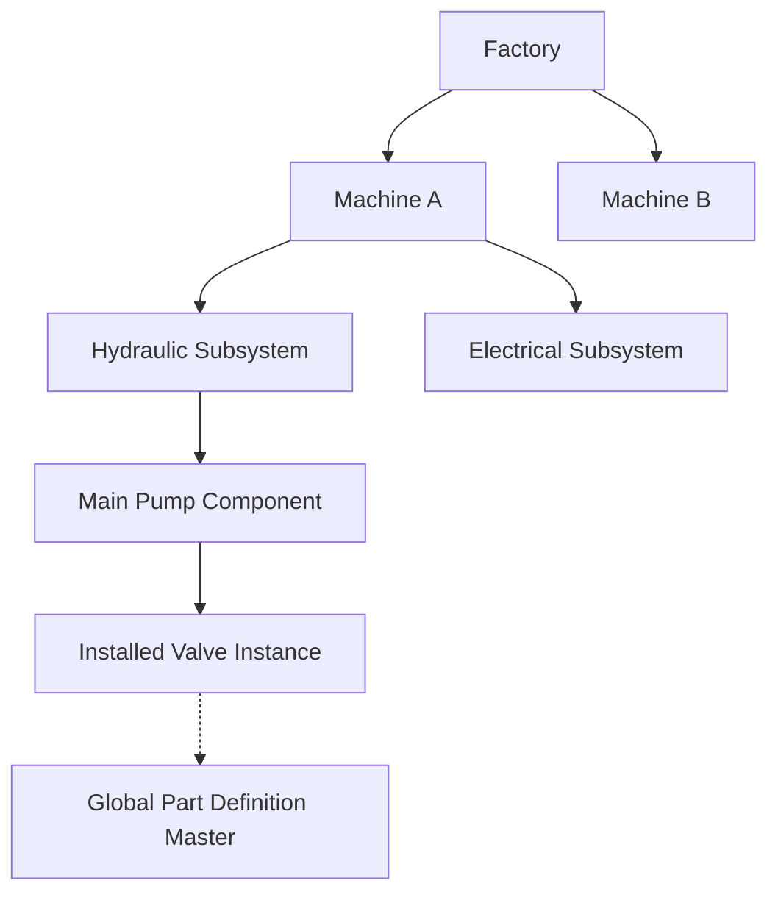
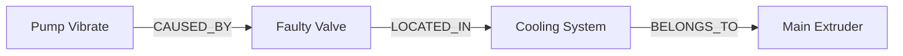

# Phase 9: Machine Intelligence Module Architecture

## Overview
The Machine Intelligence Module represents the core domain of MechaMind OS 2.0. It transforms physical factory assets into a living digital twin. By combining strict hierarchical data (Machines -> Subsystems -> Components -> Parts) with a flexible Knowledge Graph, MechaMind can accurately model both physical structure and semantic relationships.

---

## 1. Physical Hierarchy
The system enforces a strict physical containment tree:

### Key Concepts
- **Tenant Isolation**: Every entity in the tree derives its access permissions dynamically from its root `Factory`. Cross-tenant queries are structurally impossible.
- **Part Def vs. Instance**: A `PartDefinition` is a global or organization-wide master data record (e.g., "O-Ring Type B"). An `InstalledPartInstance` represents the specific physical O-Ring sitting inside Pump A.
- **Part Replacement API**: Swapping a part using the replacement API automatically marks the old instance as `RETIRED` and logs an audit trail, enabling MTTF (Mean Time To Failure) calculations.

---

## 2. Knowledge Graph (Asset Relationship Engine)
While the physical hierarchy represents *containment*, the Knowledge Graph represents *interaction*.

### The Recursive Engine
Powered by PostgreSQL Recursive CTEs, the `AssetRelationship` table can link any two entities across the OS. 
- **Relationships**: `CAUSED_BY`, `SIMILAR_TO`, `AFFECTS`.
- **Querying**: The API allows you to query `downstream` (What does this failure impact?) or `upstream` (What components cause this failure?).

### Performance
Because the traversal logic is handled natively via SQL `WITH RECURSIVE`, the application layer experiences zero N+1 latency regardless of graph depth.

---

## 3. Quantitative Risk & Health Engines
These engines provide the numerical foundation for predictive maintenance.

- **Risk Engine**: `Risk Score = Probability * Sum(Impacts)`. Factors include safety, production, and financials. Scores automatically classify assets into `LOW, MEDIUM, HIGH, CRITICAL`.
- **Health Engine**: Calculates a normalized 0-100 score by subtracting weighted degradation factors (e.g., age, vibration history) from a perfect 100 baseline. 
- **Criticality Shift Logging**: All fundamental changes to a Machine's criticality are logged into an append-only `CriticalityHistory` ledger for compliance auditing.

---

## 4. API Endpoints
All endpoints enforce JWT Authentication, RBAC (Role-Based Access Control), and Factory Scoping.

- `/api/v1/machines`: CRUD and Hierarchy retrieval.
- `/api/v1/subsystems` & `/api/v1/components`: Tree management.
- `/api/v1/parts`: Part Definitions and Instance replacement loops.
- `/api/v1/relationships`: Edge creation and native graph traversal.
- `/api/v1/risk` & `/api/v1/asset-health`: Core scoring calculators.

---

## Developer Guidelines
1. **Never bypass the EntityScopeResolver**: Always route operations through the service layer so the root `factory_id` is dynamically resolved and authorized.
2. **Hard vs. Soft Delete**: We utilize hard deletes for Knowledge Graph edges (connective tissue) but soft deletes (`is_active=False`) for physical entities to preserve historical failure context.
3. **Avoid Placeholders**: Ensure all rule-based calculations properly ingest the request payload. Do not hardcode risk variables; they must be dynamic to support future IoT integration in Phase 10.
